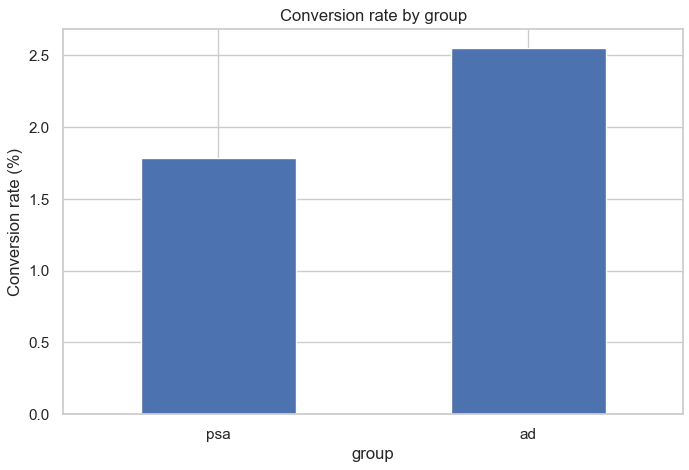
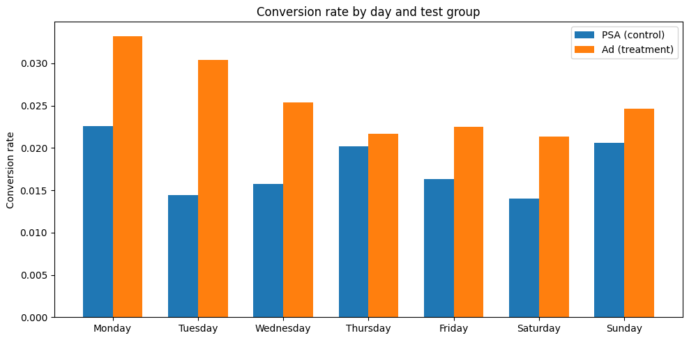
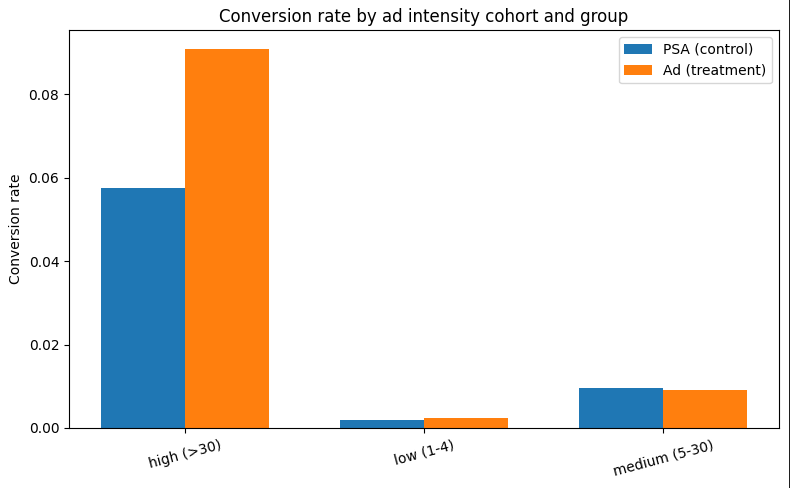

# Marketing A/B Analysis – Ad vs PSA (Kaggle `marketing_AB`)

End-to-end analysis of Ad vs PSA performance using the Kaggle `marketing_AB` dataset, with an **Experiment Integrity Audit + Decision Pack** that explicitly separates **directional evidence** from **causal claims**.


---

## Executive Summary

- **Directional business impact:** In this Kaggle marketing dataset, users associated with the **Ad** group convert at **2.55%** vs **1.79%** for **PSA** — a **+0.76 pp** lift (~**+42%** relative).
- **Integrity caveat (causal validity):** Integrity checks show this dataset does **not** behave like a clean 50/50 randomized A/B test:
  - Traffic allocation is ~**96% Ad vs ~4% PSA** (a treatment-heavy holdout pattern).
  - Exposure timing distributions (day/hour) differ significantly between groups (p ≪ 0.001).
  - These patterns can introduce confounding, so the lift should be treated as **directional / observational**, not a textbook RCT estimate.
- **What this demonstrates:** I don’t stop at a z-test. I:
  - run experiment integrity checks (SRM, balance/distribution diagnostics, data QA),
  - quantify lift + uncertainty (CI, tests),
  - and communicate when results are **directional** vs **causal**.

**Audience:** Product, Growth, and Marketing teams who need a trustworthy read on what this dataset can / cannot support.

---

## 1. Business Question

A team is deciding what to show in an ad slot:

> Should we show a **product Ad** or a **public service announcement (PSA)** to maximize purchases?

- **Control:** PSA  
- **Treatment:** Ad  
- **Primary outcome:** `converted` (0/1)

Key questions:

1. Do integrity checks indicate this behaves like a clean randomized experiment?
2. What is the estimated conversion lift (effect size + uncertainty)?
3. What would I recommend in a real team given the integrity findings?

---

## 2. Key Results (Directional)

Using the Kaggle `marketing_AB` dataset:

- **Conversion rates**
  - PSA (control): **1.79%**
  - Ad (treatment): **2.55%**
- **Absolute lift:** **+0.76 pp**
- **Relative lift:** **~+42%**

**Inference (as-computed on the full dataset):**

- Two-proportion z-test: z ≈ **7.4**, p-value **≪ 0.001**
- 95% CI for lift (Ad − PSA): approx **[0.60, 0.94] pp**

**Interpretation (important):**

> The Ad group has meaningfully higher conversion **in this dataset**. However, because integrity checks show strong traffic imbalance and timing differences, this result should be treated as **directional evidence** rather than a fully causal estimate from a classic 50/50 RCT.

---

## 2.1 Experiment Integrity & Limitations (Decision Pack)

This repo includes an integrity audit pipeline under `decision_pack/` that generates a markdown integrity report.

### Integrity findings on this dataset

- **Traffic allocation / SRM diagnostic (vs a 50/50 reference split):**
  - Observed: **~564,577 Ad vs ~23,524 PSA** (~96% vs ~4%)
  - Conclusion: This dataset does not resemble a balanced 50/50 A/B. It looks like a **treatment-heavy holdout**.
  - Note: SRM is only “failure” relative to an assumed target split. This dataset may have been designed as a holdout rather than 50/50.

- **Timing distribution diagnostics:**
  - Day-of-week and hour-of-day differ significantly across groups (p ≪ 0.001).
  - With large samples, small differences become statistically detectable; however these signals still indicate groups may not be perfectly comparable across time windows.

### Practical implication

- Treat the full-dataset lift as a **campaign-style comparison** rather than a pure randomized A/B test result.
- In a real team, I would recommend:
  - enforcing an explicit traffic split (or documenting the holdout design),
  - adding real-time SRM monitoring,
  - and collecting true pre-treatment covariates (device/source/geo) for stronger balance validation.

### Docs
- Experiment Design Spec: `decision_pack/docs/experiment_design_spec.md`

---

## 3. Visuals (Selected)

### 3.1 Conversion rate by group



### 3.2 Conversion rate by day and test group



### 3.3 Conversion rate by ad-intensity cohort and group



---

## 4. Tech Stack

- **Python / Jupyter:** `pandas`, `numpy`, `matplotlib`, `statsmodels`, `scipy`
- **dbt:** staging → intermediate → marts for experiment features/cohorts
- **Custom Python module:** `src/ab_experiment/` for reusable experiment stats
- **Decision Pack pipeline:** `decision_pack/src/abpack/` for integrity checks + report generation
- **(Planned) Tableau:** dashboards

---

## 5. Repository Structure

```text
.
├── data_raw/
│   └── marketing_AB.csv
├── dbt_marketing_ab/
│   └── models/...
├── notebooks/
│   ├── 01_eda_and_integrity_diagnostics.ipynb
│   ├── 02_ab_test_frequentist_and_power.ipynb
│   └── 03_cohort_heterogeneity_and_recommendations.ipynb
├── decision_pack/
│   ├── data/
│   │   └── marketing_ab.csv
│   ├── reports/
│   │   └── integrity_report.md
│   └── src/abpack/
│       ├── io.py
│       ├── checks.py
│       └── run.py
├── src/
│   └── ab_experiment/
│       ├── data_access.py
│       └── stats.py
├── visuals/
│   ├── conversion_rate_by_group.png
│   ├── conversion_rate_by_day_and_test_group.png
│   └── conversion_rate_by_ad_intensity_cohort_and_group.png
├── README.md
└── requirements.txt
```

---

## 6. Notebooks Overview

### `01_eda_and_integrity_diagnostics.ipynb`

**Goal:** Audit assignment/allocation assumptions and run integrity diagnostics before trusting lift.

- Group sizes and allocation pattern (holdout vs 50/50)
- Distribution diagnostics: day-of-week/hour-of-day
- Data QA checks (missingness, duplicates, label sanity)
- Clear write-up of limitations for causal interpretation

### `02_ab_test_frequentist_and_power.ipynb`

**Goal:** Estimate lift + uncertainty.

- Conversion rates, absolute/relative lift
- z-test + confidence intervals
- power/MDE discussion (with caveats given unequal allocation)

### `03_cohort_heterogeneity_and_recommendations.ipynb`

**Goal:** Segment-level directional insights (with caution about confounding).

- Cohorts (day-of-week, intensity buckets)
- Practical recommendations + follow-up experiment design

---

## 7. How to Run Locally

Create a virtual environment and install dependencies:

```bash
python -m venv .venv
# Windows: .venv\Scripts\activate
pip install -r requirements.txt
jupyter lab
```

Generate the integrity report:

```powershell
cd "C:\path\to\marketing-ab-experiment"
python decision_pack/src/abpack/run.py
```

---

## 8. What this project demonstrates

- **Experimentation thinking:** integrity checks before claiming impact
- **Statistical estimation:** lift + CI + hypothesis testing
- **Analytics engineering:** reusable modules + reproducible reports
- **Stakeholder communication:** clear distinction between directional vs causal conclusions

---

## 9. Experimentation Decision Pack (Integrity + Memo)

Alongside the notebooks and core `src/ab_experiment` module, this repo includes a small “decision pack” under `decision_pack/`:

- `decision_pack/src/abpack/`:
  - `io.py` – load and normalize the Kaggle marketing_AB dataset
  - `checks.py` – SRM diagnostic, categorical distribution checks (day/hour), basic data quality checks
  - `run.py` – generates an integrity report in markdown
- `decision_pack/reports/`:
  - `integrity_report.md` – SRM, timing distribution diagnostics, and QA findings

This mirrors how I’d treat an experiment in production: **run integrity checks first, then decide whether the lift is trustworthy enough to use for high-stakes decisions.**

---

## 10. Roadmap / Future Work

- Add effect-size reporting for distribution diagnostics (e.g., Cramér’s V) to quantify practical vs statistical differences
- Build a “balanced subset” analysis (matched Ad sample to PSA) as a pedagogical A/B-style comparison (clearly labeled as a constructed subset)
- Tableau overview dashboard + drill-downs
- Logistic regression / causal modeling with covariates (if available)
